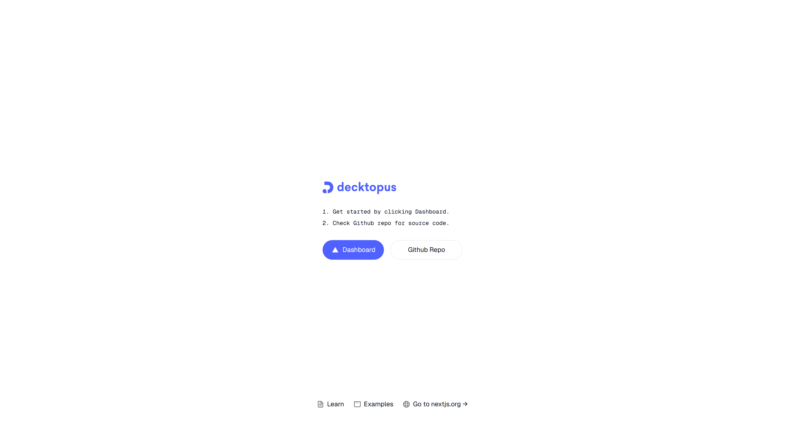
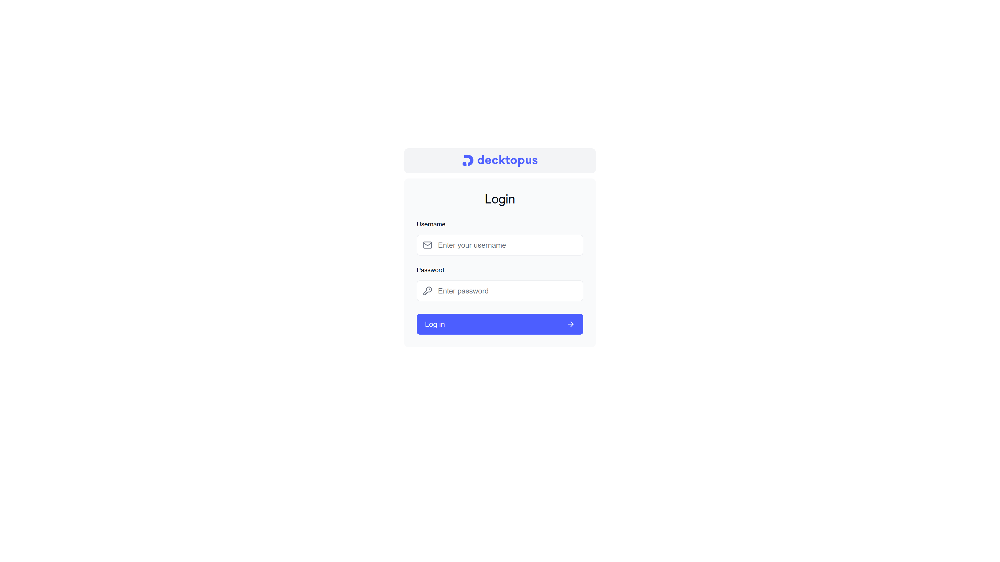
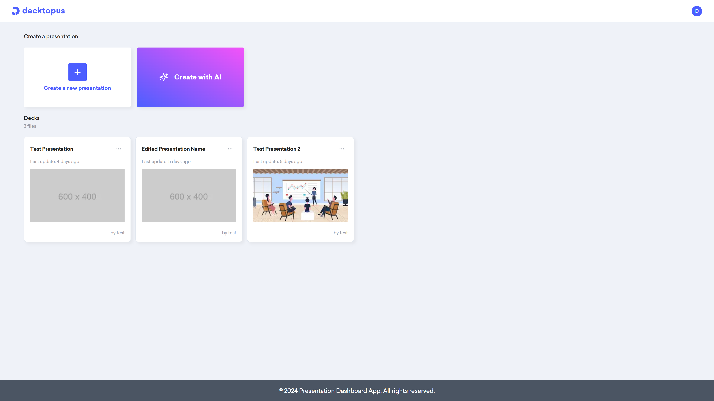
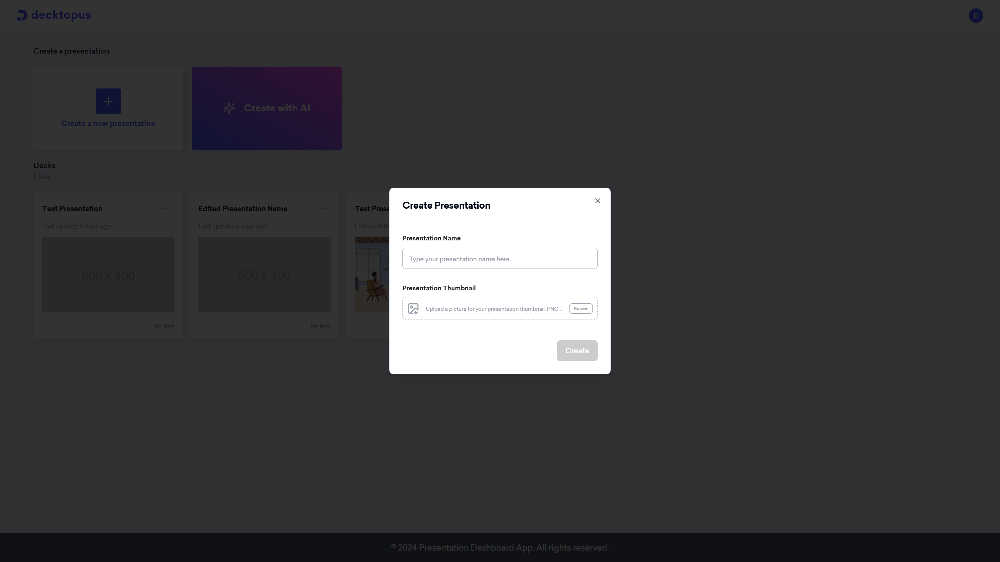
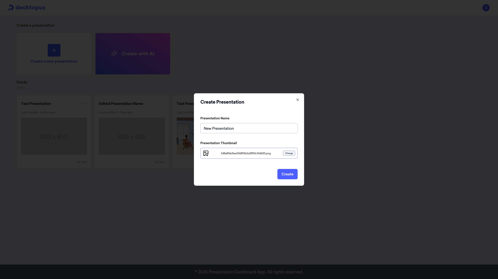
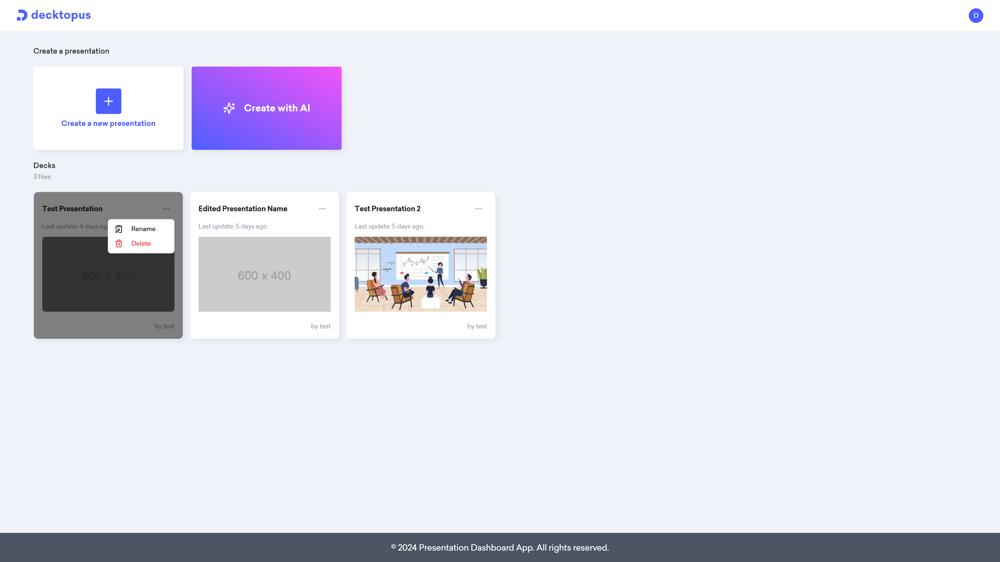
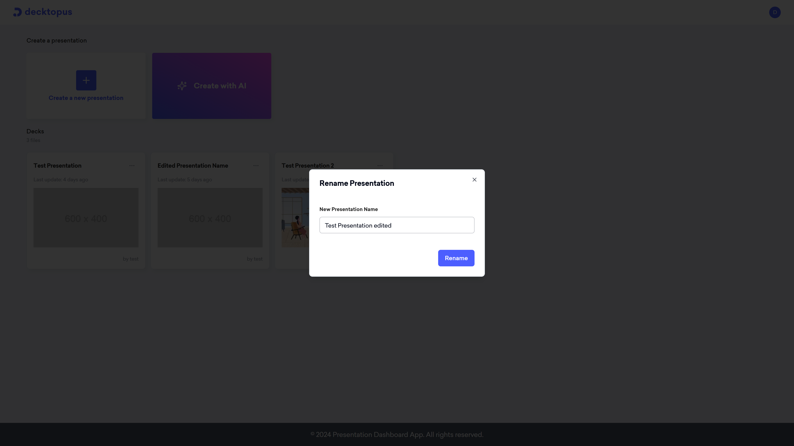
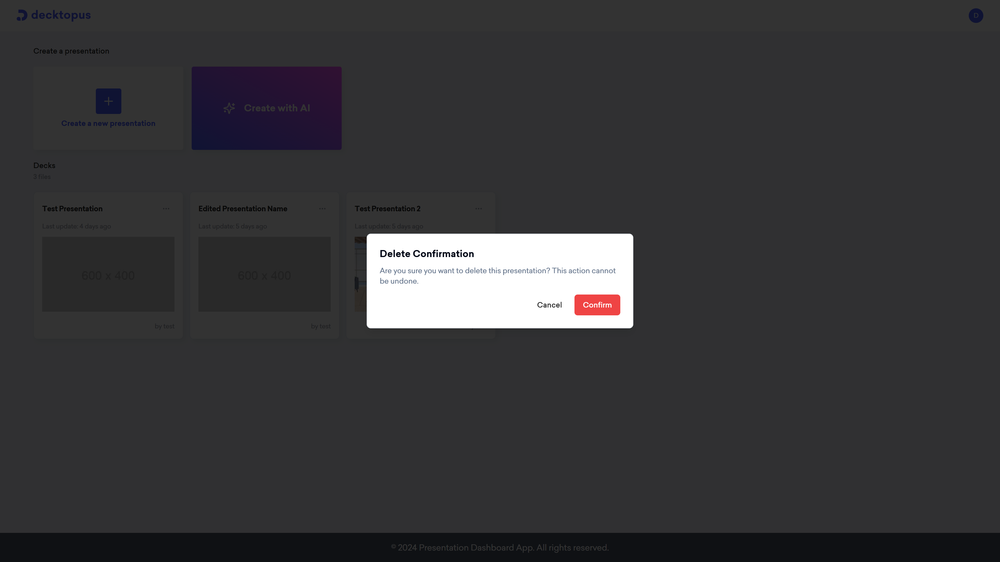

<div align="center">
    <p align="center">
        <a href="https://nodejs.org/">
            
        </a>
    </p>
</div>
<br>
<p align="center">
    <a href="https://github.com/berkanumutlu/challenge-nodejs-presentation-dashboard-app/stargazers" rel="nofollow"></a>
    <a href="https://github.com/berkanumutlu/challenge-nodejs-presentation-dashboard-app/blob/master/LICENSE" target="_blank" rel="nofollow"></a>
    <a href="https://nodejs.org" target="_blank" rel="nofollow"></a>
    <a href="https://nextjs.org/docs/14" target="_blank" rel="nofollow"></a>
     <a href="https://18.react.dev" target="_blank" rel="nofollow"></a>
    <a href="https://tailwindcss.com" target="_blank" rel="nofollow"></a>
    <a href="https://ui.shadcn.com" target="_blank" rel="nofollow"></a>
    <a href="https://www.prisma.io" target="_blank" rel="nofollow"></a>
    <a href="https://www.postgresql.org/docs/release/15.7" target="_blank" rel="nofollow"></a>
    <a href="https://www.npmjs.com" target="_blank" rel="nofollow"></a>
    <a href="https://www.docker.com" target="_blank" rel="nofollow"></a>
</p>

# [Challenge] Presentation Dashboard App with Node.js

It is a challenge project that aims to create a presentation management dashboard using Node.js, React and PostgreSQL.

## Installation

**1)** Clone repository

```shell
$ git clone https://github.com/berkanumutlu/challenge-nodejs-presentation-dashboard-app.git
```

Or with SSH

```shell
$ git clone git@github.com:berkanumutlu/challenge-nodejs-presentation-dashboard-app.git
```

Or with Github CLI

```shell
$ git clone gh repo clone berkanumutlu/challenge-nodejs-presentation-dashboard-app
```

**2)** Copy the example.env file and **make the required configuration changes** in the file

```shell
$ cp /src/api/.env.example /src/api/.env
$ cp /src/app/.env.example /src/app/.env
```

**3)** Install docker container (required docker)

```shell
$ docker-compose up -d
```

**4)** After installation, find your app and api container id on docker

```shell
$ docker ps

# Output:
CONTAINER ID   IMAGE                                             COMMAND                  CREATED      STATUS          PORTS                                        NAMES
...
d3cf849b1b36   challenge-nodejs-presentation-dashboard-app-app   "docker-entrypoint.s…"   2 days ago   Up 37 minutes   0.0.0.0:3000->3000/tcp                       presentation-dashboard-app    
...
```

- And connect to the terminal of your app and api container (Use different terminals)

```shell
$ docker exec -it {APP_CONTAINER_ID} bash
$ docker exec -it {API_CONTAINER_ID} bash
```

**5)** Install all the dependencies using npm (In different terminals)

```shell
/user/local/api $ npm install
/user/local/app $ npm install
```

**6)** Generate mock data

```shell
/user/local/api $ npm run db:seed:mock
```

**7)** Restart your docker container

```shell
$ docker-compose restart
```

**8)** Now you're ready to use project

- To stop the Docker container, use the following command

```shell
$ docker-compose stop
```

## Screenshots

<ul>
    <li>
        <p>Home Page & Admin Login Page</p>
        <p align="center">
            
            
        </p>
    </li>
    <li>
        <p>Dashboard</p>
        <p align="center">
            
        </p>
    </li>
    <li>
        <p>Create Presentation Modal</p>
        <p align="center">
            
            
        </p>
    </li>
    <li>
        <p>Presentation Item Menu</p>
        <p align="center">
            
        </p>
    </li>
    <li>
        <p>Rename & Delete Presentation Modal</p>
        <p align="center">
            
            
        </p>
    </li>
</ul>

## Preview

[](https://www.loom.com/share/cf82b552a7d04a1084123ea33e85e1e1?sid=9038fd59-3cdf-4742-a8d2-1e313203bff5)

## License

The MIT License (MIT). Please see [License File](LICENSE) for more information.
